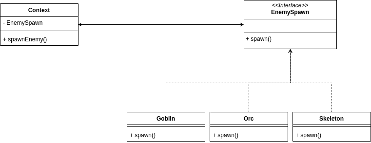

# Strategy
Lets you define a family o algorithms, put them in separate class, and make their objects interchangeable.

### Example

In this example we have an interface called EnemySpawn, and we have a class EnemySpawner 
that use the method spawn() from this interface, them we have 3 concrete classes of enemies 
that implements that interface and has the implementantion of the enemy spawn() method. With that
we follow the OCP because if we want to add a new enemy we only need to create a new enemy
concrete class and implements the EnemySpawn interface and don't need to change any code.