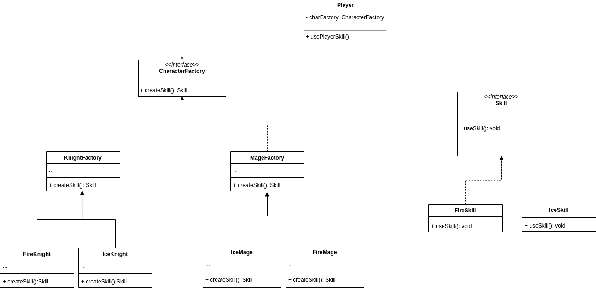

# Abstract Factory 
With this pattern you can produce family of objects without specifying the concrete classes.

### Example

This pattern helps to follow the OCP for more complex objects that have more variations.
