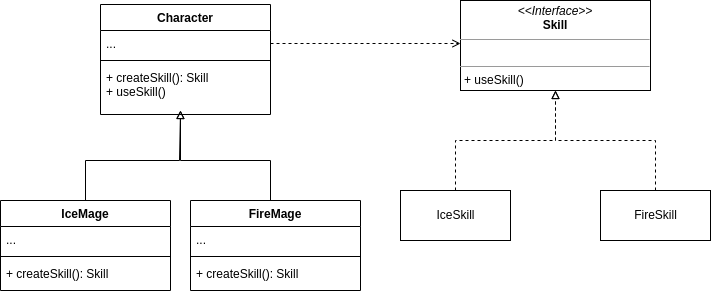

# Factory Method
Provides an interface for creating objects in a superclass, but allows subclasses to alter the type of objects that will be created.

### Example

In this example we have an abstract class Character that has the createSkill method that return a SkillInterface.
Then in the concrete Character classes "IceMage" and "FireMage" we have the implementation of createSkill method. It is a good pattern
to follow the OCP(Open Closed Principle) and SRP(Single Responsibility Principle), because if you want to add
another types of mages you can just extends the Character class without need to change the base class.